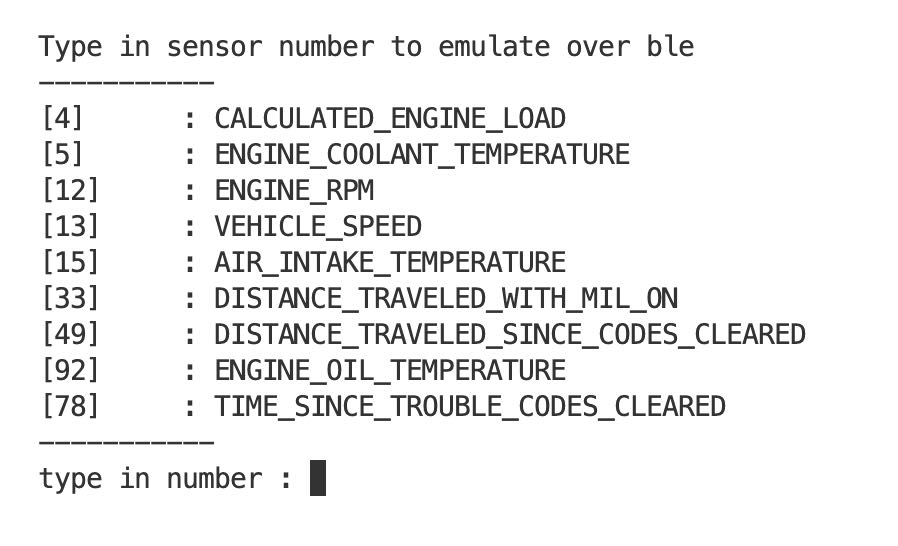

## Hi there 👋

👨‍🚀 Useful resources - where can the community find your docs? Is there anything else the community 
should know?

**```ble_serial_emulator```**



**```ble_gatt_uuid_generator```**

**```obd2-serial-ble-bridge```**
